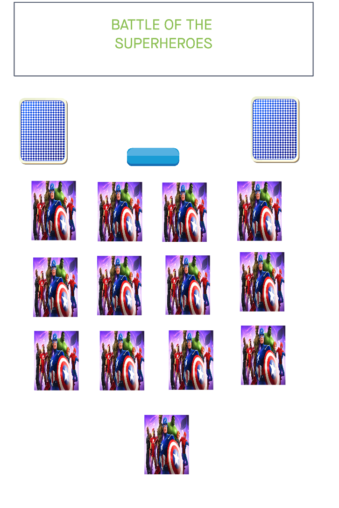

Battle of the Superheroes

The Goal
The goal is to be the first player to get all 52 cards.

The deal:
The deck is evenly divided, each player recieving 26 cards each.

THE PLAY
The player turns up a card at the same time as the computer and the player with the higher rank takes both cards and puts them, face down, on the bottom of his stack.

If the cards are the same rank, it is War. Each player turns up one card face down and one card face up. The player with the higher rank takes both piles. If the turned-up cards are again the same rank, each player places another card face down and turns another card face up. The player with the higher card takes all 10 cards, and so on.

Technologies used
1. HTML.
2. CSS.
3. Javascript.
4. GoogleFonts
5. jquery.
6. API - https://github.com/akabab/superhero-api/tree/0.3.0/api

Screenshots

